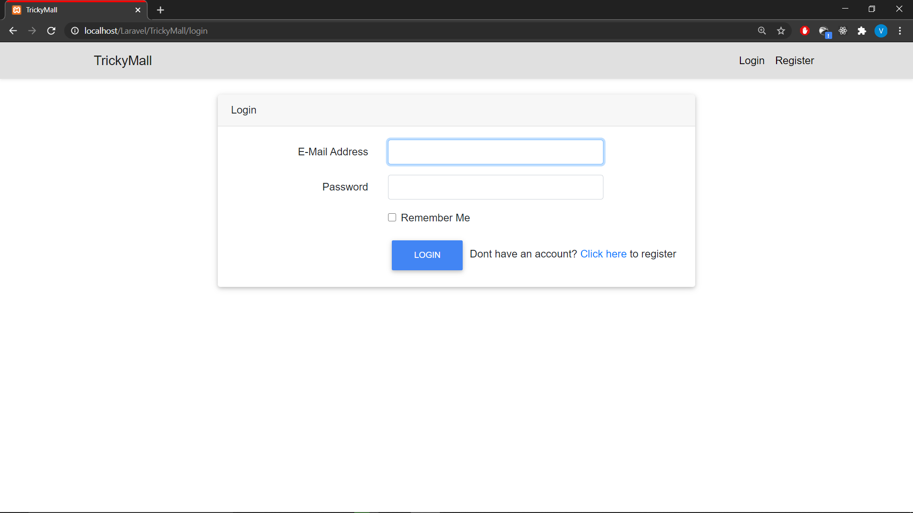
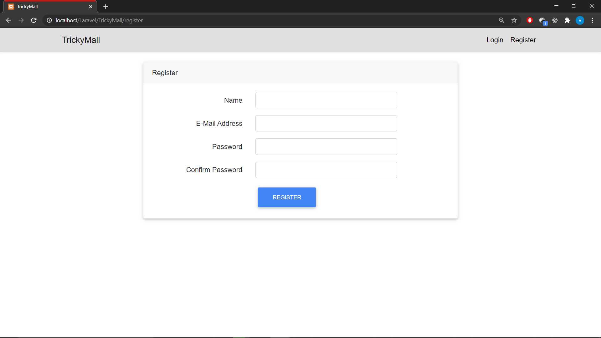
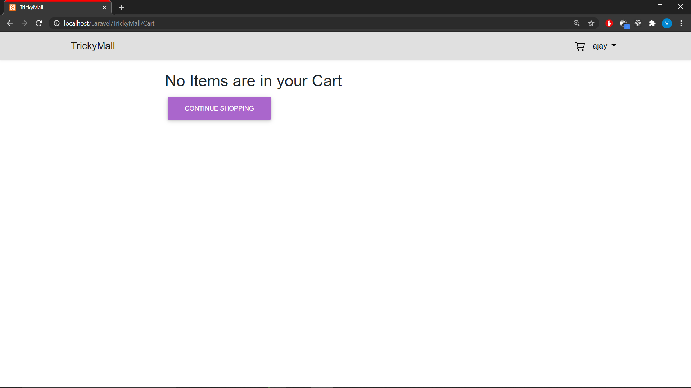
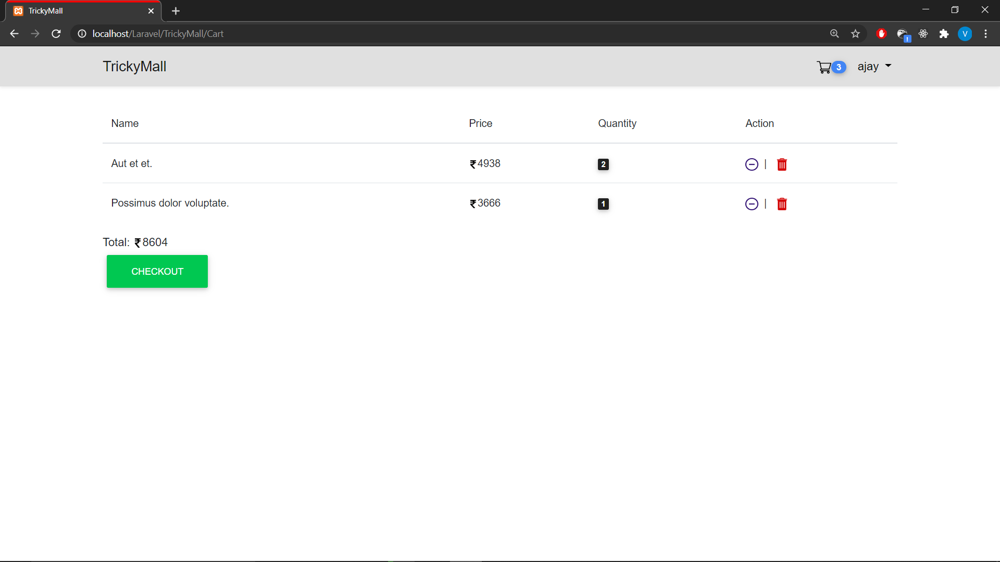
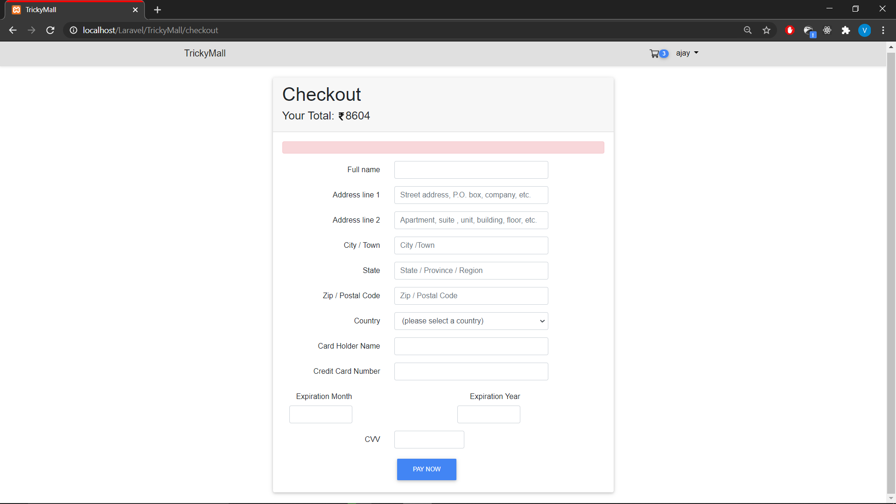
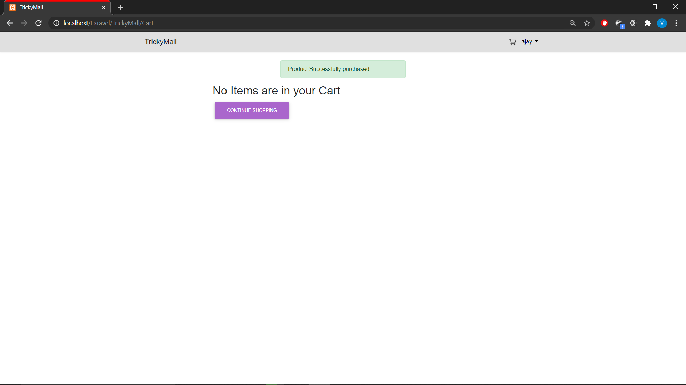
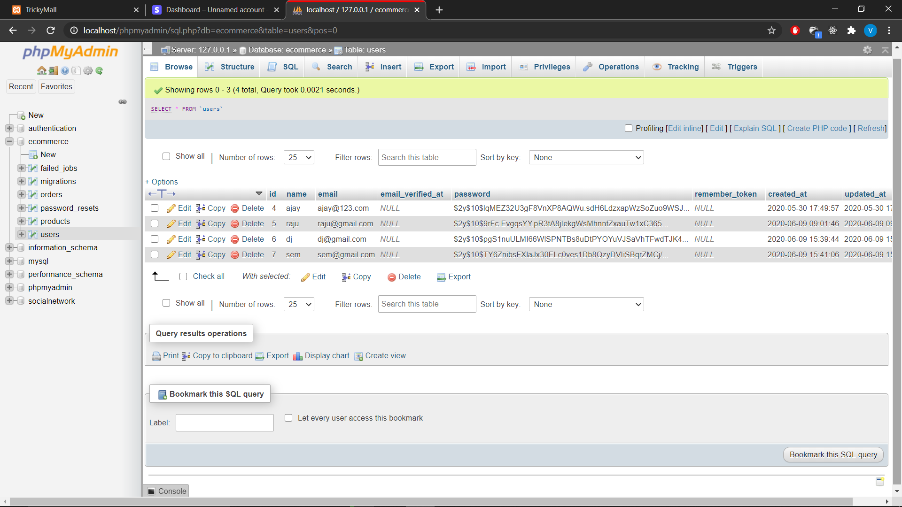
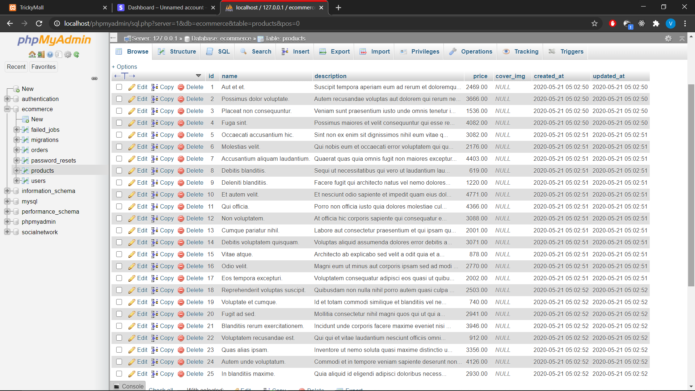
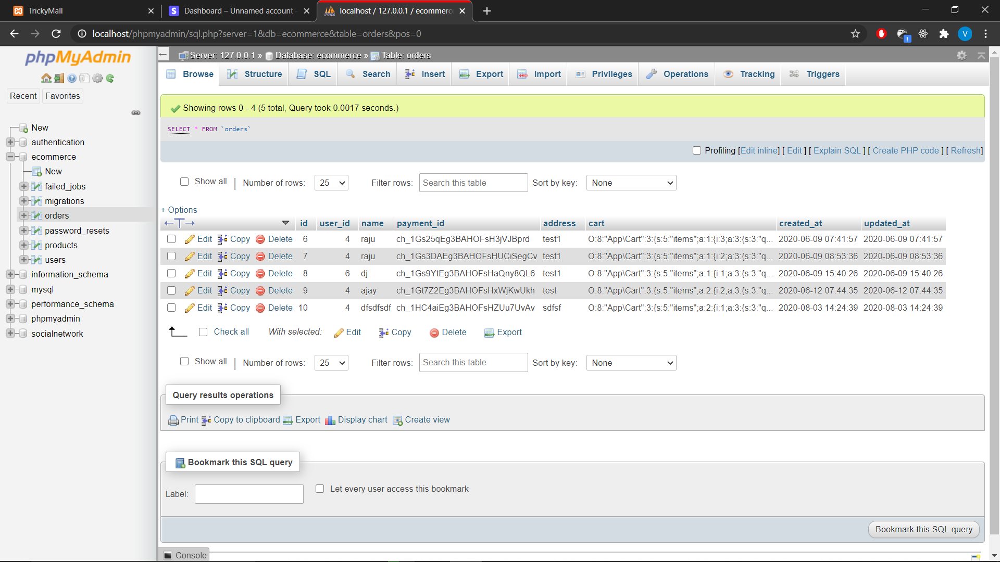
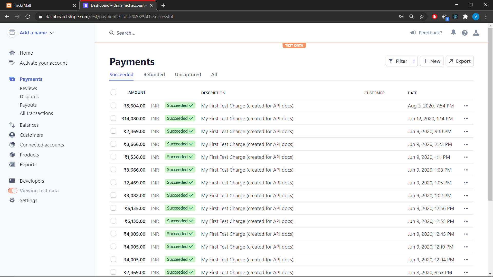

# TrickyMall
   An e-Commerce app where users can add and store products in their cart, purchase online through Stripe payment gateway.

## Requirements
   * Xampp - php 7+
   * phpMyAdmin
   * Composer
   * Laravel 7.x
   * Stripe account

## Installation
   1. [Download & install xampp server](https://www.apachefriends.org/download.html)
   2. [Install composer in your local machine](https://getcomposer.org/download/)
   3. Now install Laravel globally using the cmd: `composer global require laravel/installer`
   4. After installation create a new project folder inside `C:\xampp\htdocs`and open command prompt in the same path.
   5. Type in the following command `laravel new project_name` for installing all the dependencies for your project.
   6. Check the app in your browser by typing `localhost/project_root/public/`

## Features
- User account
   - A simple registration form with four input fields.
   - A login form with redirection to registraion form.
   - Created users table in phpMyAdmin under database e-commerce

- Cart
   - Registered users can add new items to their cart.
   - Same items quantity can be changed.
   - Items in the cart can be proceed to payment.

- Checkout
   - Checkout form is redirected from the cart page.
   - Dummy Credit card details will be validated on submit.

- Stripe
   - On submitting the checkout form payment details will be sent to the Admin's stripe dahboard.
   - Admin can manage the payment transfered.

- Orders history
   - Users can check their orders in their profile.
   - Orders total is displayed at the page.
   - Created orders table in the e-commerce database 

- Future features
   - e-mail & sms notification.
   - Order cancel and refund request.
   - Order tracking system.
   - Related products recommendation system.

---

## Exploring the app

### Home page

### Login view

### Registration 

### Initial cart

### Cart with items

### Checkout 

### Purchase notification

---

## Database structure

### Users table

### Products table

### Orders table

---
## Stripe

### Admins dashboard

---
# Bugs
 - Page refresh when adding items to cart.
 - Item quantity increment does'nt exists in cart.
 - Empty order history throw errors.
 - Default master card token passes to stripe even if the card info is invalid.
 - Orders history shows wrong summation of total.
